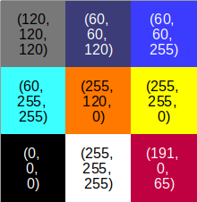
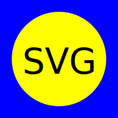

# This book

This book aims to introduce the domain of applying Deep Learning to [vector graphics](https://en.wikipedia.org/wiki/Vector_graphics), such as [SVG](https://developer.mozilla.org/en-US/docs/Web/SVG), and to identify and summarise relevant prior work.

The focus is on content related to the aim of end-to-end generative deep learning models for vector graphics. But other content, such as object localization and classification within vector graphics, may also be covered.

This book is an hommage to those amazingly talented and kind scientists, engineers and artists who paved the way and inspired the author, such as **David Ha** ([Twitter](https://twitter.com/hardmaru), [Website](https://otoro.net/ml/)) or **Raphael Gontijo Lopes** ([Twitter](https://twitter.com/iraphas13), [Website](https://raphagl.com/)).

## Raster images vs. vector graphics

### Raster images are based on a grid of pixels

Raster images consist of a grid of pixels. In a simple greyscale image, a single pixel already holds a single numeric value, e.g. from 0 (black) to 255 (white), with all the shades of grey in between. Color images, such as RGB images, work the same way but with one numeric value per channel (R = red, G = green, B = blue) and per pixel.

:::{figure-md} raster_image_png


Illustration of a 3x3 pixel RGB raster image; each pixel contains 3 values, one for each red (R), green (G), and blue (B) channel.
:::

### Vector graphics are based on the mathematical description of paths

Vector graphics, on the other hand, are not based on a grid of pixels but based on mathematical descriptions of points, lines etc. in an two-dimensional (Cartesian) coordinate system. A point, for example, will be defined by its (x,y) coordinates.

One major advantage of vector graphics is that they are infinitely scalable. Another advantage is that their file size is small and independent of the image's size and resolution. This is why, for instance, fonts, icons and logos are often designed as vector graphics.

A common vector graphics format is the Scalable Vector Graphics format (SVG). This format is XML-based and, thus, a text-based description of the image using a hierarchical structure of nested tags and their associated attributes. 

Below is an example of simple SVG:

```XML
<svg version="1.1"
     width="200" 
     height="200"
     xmlns="http://www.w3.org/2000/svg">

  <rect width="100%" height="100%" fill="blue" />

  <circle cx="100" cy="100" r="80" fill="yellow" />

  <text x="100" y="125" font-size="60" text-anchor="middle" fill="black">
    SVG
  </text>

  <path d="M 30 160 q 50 -50 140 0" stroke="red" stroke-width="8" fill="none" />

</svg>
```

The code above defines four elements in the SVG image:
* A rectangle using the SVG element `<rect>`
* A circle using the SVG element `<circle>`
* A text using the SVG element `<text>`. The content of the text is enclosed by the opening `<text>` and closing `</text>` tags. 
* A path using the SVG element `<path>`. The actual path definition is in the `d` attribute which contains a sequence of commands and parameters. E.g. `M 30 160` means that the cursor position is moved to position (30, 160). From that point, a quadratic bézier curve (`q`) is drawn.

Details of how SVG works can be found in the corresponding section.

Once rendered by the browser, the SVVG image looks like this:

:::{figure-md} about_example_svg


Example SVG as rendered by the browser
:::


## Why is Deep Learning with Vector Graphics special?

The application of Deep Learning to raster images has been well-researched and is relatively straightforward. One reason for this is that raster images play an important role in many domains. Another reason is that a grid of pixels is already very close to the data representation required by machine learning algorithms. Machine learning algorithms, such as Deep Neural Networks, require the input data to be represented as a collection of numeric values (a data structure called a *tensor*). Representing a raster image as such a tensor is straight-forward.

The following aspects are some of the reasons why deep learning with SVG images is special:

1. The SVG format is text-based and not a grid of pixels. In this regard, deep generative models for SVG images are closer to sequence generation in natural language processing (NLP).
1. The SVG format is an XML subset and, thus, uses (deeply) nested tags. And each tag can have a multitude of attributes.
1. Shapes can be defined on different abstraction levels, e.g. on a higher abstraction level as a rectangle `<rect>` or on a lower level as a path `<path>`.
1. A path is a variable-length sequence of commands. However, in Deep Learning all samples are expected to be represented by a vector of identical length. This means a vector length has to be chosen that is sufficiently large and unused space needs to be padded. 
1. To display an SVG image on a computer screen, it needs to be converted into a grid of pixels ("rasterised"). This is done by the browser or other viewing application. This process is complex.
1. SVG elements can overlap and occlude each other, so that parts may not be visible when rasterised.
1. There is no one-to-one correspondence between SVGs and their respective raster image. Different SVGs may result in the same raster image and, thus, the process of converting a raster image back to its corresponding vector format is ambiguous.
1. Deep learning requires a differentiable loss function for backpropagation to work. Until recently, no differentiable rasteriser existed. And the existing differentiable rasteriser (diffvg) is computationally expensive and not accurate.
1. The different components of an SVG may have different x,y positions relative to another. Maintaining these positions is another challenge.