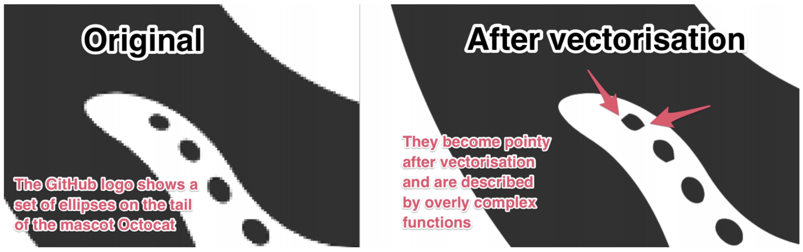

# Arguing for E-2-E approach

A book about Deep Learning with Vector Graphics also needs to make the point why an end-to-end (E-2-E) approach appears to be a desirable objective. End-to-end in this context shall refer to a generative Deep Learning model that is fed vector graphics and directly outputs vector graphics. 

End-to-end in this context shall not exclude multi-modal approaches where, _in addition_ to the vector graphic, other types of inputs are used, such as text descriptions or the corresponding raster image. Multi-modal may even be a required setting for some problems.

Here are a few bold claims (that may still require evidence):

## 1. More efficient and faster

Training on SVG could be much faster since vector graphics can store information much more efficiently than raster images. This is obviously the case if an image has been designed as a vector graphic from the start. The rastered image file will be much larger and even "empty" pixels need to be described using their RGB(A) values.

Training DeepSVG, for example, on a small dataset using an RTX 3090 takes less than an hour. Training models for raster images generally takes much longer: days, if not weeks.

## 2. More effective

If obtaining SVG is our goal, then the approach of using generative models for raster images and to then convert their output to vector graphics is futile. Current generative models are not conditioned to produce output that is easily converted to vector graphics, especially when it comes to colour images (as opposed to black and white images). And such a conditioning would not be trivial.

## 3. Rasterising a vector graphics leads to information loss

Learning about the composition of an SVG (e.g. how shapes are represented, the number of layers, ...) is only possible if this information is fed into the model. A rasterised image has lost that information.

## 4. Maintaining symmetries, perfect angles, clear color boundaries etc.

Many logos and icons make use of perfect symmetries and perfect 90° angles. This information could be maintained if both input and output are vector graphics. Colour inputs often lead to watercolor effects where boundaries between shapes get blurry.

**Example:**

Have a look at the following figure which shows 4 different icons which have been reconstructed by a VAE. The icons were originally SVG icons and presented to the VAE as 128x128 rasterised images. Thus, the VAE was trained on raster images only.

:::{figure-md} reconstructed_icons_vae

Unclear color boundaries (VAE-reconstructed icons; VAE was trained on 128x128 pixel rasterised vector graphics)
:::

While the black and white characters would be relatively easy to vectorize, the icon in the upper right corner would not. The outline of the overall shape and the check mark have been reconstructed very well. But the blue shapes that make up the shield bleed into each other and now have irregular color gradients.

In the following figure, the target icon in the lower right corner looks like a watercolor painting. Especially this watercolor effect makes vectorizing these results very difficult.

:::{figure-md} reconstructed_icons_vae_2

Undesirable watercolor effect (VAE-reconstructed icons; VAE was trained on 128x128 pixel rasterised vector graphics)
:::

The figure below shows a "location pin" generated by DALL-E trained on a custom dataset of raster images (after 7 epochs). There were approximately 8,000 examples in this "location pin" class. Practically all examples were symmetrical (could be mirrored along the y axis) and used a perfect circle as shape in the centre. The generated example has lost these properties. For icons, this type of fidelity or precision in the reproduction of concepts matters.

:::{figure-md} location_pin_generated_by_dall-e

Icon of a "location pin" generated by DALL-E trained on a custom dataset of raster images (after 7 epochs)
:::

DALL-E is only implicitly learning the symmetry in the training examples; there is no explicit conditioning on these properties.

## 5. Current vectorizers are doing a poor job

Current tools for converting a raster image (e.g. a PNG) to a vector graphic ("tracing" or "vectorization") are still doing a poor job.

**Main issues with current vectorizers:**

* No context-aware tracing
  * E.g. not prior classification of objects and if they should be round or edgy
  * E.g. the bottom of a heart shape becomes round (--> incorrect points / edges)
  * Identical elements of different sizes may get traced differently.
* No resolution-aware tracing
  * At low input resolution, tracers may start to follow pixel borders like steps
  * E.g. a vectorizer may fail to recognize that a shape was likely a circle even though it is now a 20x20 pixel blob with step-like sides
* No shape-aware tracing
  * Images get vectorized as paths -- even though some aspects could be vectorized as basic shapes, e.g circles, rectangles, ellipses
* Potentially incorrect trade-off between accuracy and number of points
  * Vectorizers rarely produce elegant results with minimal number of points
* Over-use of points vs. a smart use of bezier curves and their handles
* No or poor detection of colour gradients
* No consideration of symmetry
  * Many glyphs and icons have symmetries of some kind (reflectional, translational, rotational, ...)
  * Current vectorizers are insensitive to symmetries
* Tracers do not understand how humans compose images from multiple shapes (potentially overlapping, potentially half-transparent), e.g. shadows
* SVGs just have too many parameters and an intractable complexity for current vectorizers to correctly guess them all given a raster image

Even the Deep Learning-based vectorizers Im2Vec cannot fully address the above issues. Im2Vec has been trained on raster images only and lacks awareness of the true underlying composition of the original vector graphics.

### Examples

**Example 1:**

The image below shows the "Octocat", Github's mascot.

:::{figure-md} GitHub-Mark

Github's mascot Octocat
:::

Note the ellipses on the octocat's tentacle-tail in the figure above.
Vectorizing a low resolution version of that section of the image leads to a poor result, see the figure below:

:::{figure-md} vectorizing_still_poor

Current vectorizers are still performing poorly. In this case, the used tool was [vectormagic](https://vectormagic.com/) -- still one of the better tools out there and not free.
:::

The low resolution results in the smaller ellipses to have corners in the vector output. It appears that the vectorizer has no understanding that the resolution of the input is low and pixel edges and corners should not be traced too closely. The vectorizer also has no contextual understanding that there is a symmetry in these shapes: all of these are ellipses of different sizes.

**Example 2:**

In another example, see figure below, an image loses its perfect symmetry through vectorization.

:::{figure-md} vectorizing_destroy_symmetry

Example from [imagetracerjs](https://github.com/jankovicsandras/imagetracerjs)
:::

**Example 3:**

Vector graphis, such as SVG, can make use of linear and radial gradients. This can produce visually pleasing results, such as this logo below:

:::{figure-md} edge

Microsoft Edge logo designed as a vector graphic in SVG format; [source](https://www.npmjs.com/package/@browser-logos/edge)
:::

Since this logo was designed as an SVG, we know it is possible to design such a logo as a vector graphic.
Here is the SVG code for the logo above:

:::{figure-md} edge_logo_svg

SVG code of the Microsoft Edge logo
:::

However, current vectorizers have a hard time converting a rasterized version of the logo back to a vector graphic.
These algorithms have no understanding of what (potentially overlapping) shapes are required and what shapes need to have what type of linear or radial gradients. There are too many parameters at play for pre-Deep Learning algorithms to work well.

:::{figure-md} vectorized_edge_logo

Screenshot of the vectorized Microsoft Edge logo; vectorized using [vectorizer.io](https://www.vectorizer.io). The vector result is much more complicated than the original SVG and no where near the original in terms of quality.
:::

**Example 4:**

Consider the reconstructed icon below:

:::{figure-md} vectorizers_have_hard_time

Lacking contextual awareness of current vectorizers
:::

Current vectorizers will not understand that the icon consists of two identical hearts. The black outline on top, and the orange heart underneath and slightly offset.

### Conclusion regarding poor vectorizers

Because current vectorizers are performing poorly (and will hopefully soon be replaced by smarter Deep Learning-based algorithms), there is a need to output vector graphics directly. Instead of attempting to output raster images and only then vectorize them.