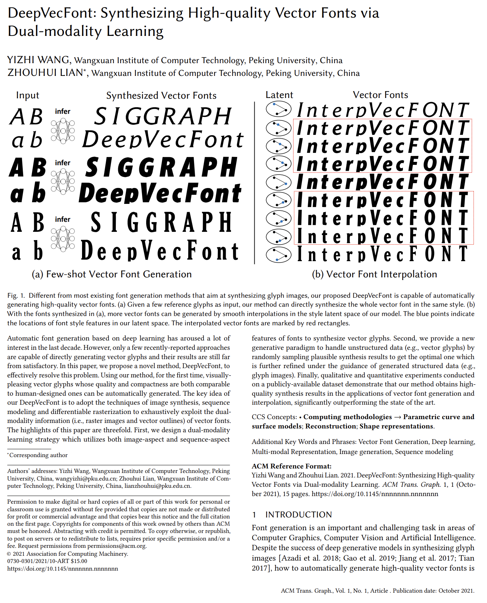

# Wang and Lian (2021) | DeepVecFont: Synthesizing High-quality Vector Fonts via Dual-modality Learning

:::{figure-md} wang_and_lian_2021_cover

Screenshot of the DeepVecFont [paper](https://arxiv.org/pdf/2110.06688.pdf) by Wang and Lian (2021)
:::