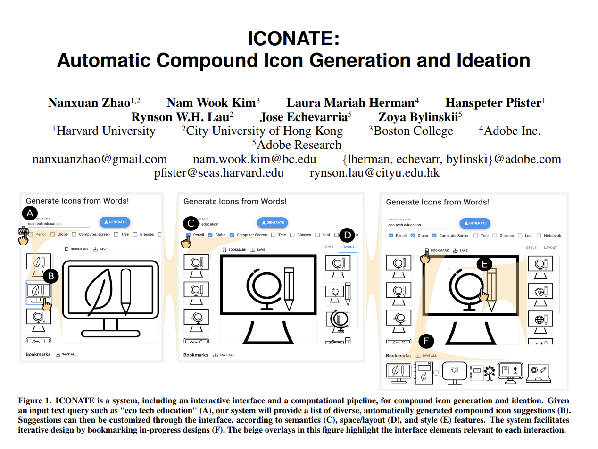

# Zhao et al. (2020) | ICONATE: Automatic Compound Icon Generation and Ideation

Zhao et al. introduce a system for automating the process of generating compound icons. Compound icons are icons that consist of multiple icons, each symbolizing one aspect of the overall concept. The icons are generated based on a textual query. ICONATE does *not* generate the icon components. It is a computational pipeline that automatically retrieves commonly used icons for sub-concepts and arranges them according to inferred conventions.


```{admonition} Available resources at a glance
* [Paper PDF](http://nxzhao.com/projects/ICONATE/CHI2020_ICONATE.pdf)
* [Project website](http://nxzhao.com/projects/ICONATE/)
* [Online demo of ICONATE](https://iconate.namwkim.org/)
* [Online demo of the annotation tool](https://iconnotate.namwkim.org/)
```


:::{figure-md} diffvg_cover


Screenshot of the [Zhao et al. paper](http://nxzhao.com/projects/ICONATE/)
:::
