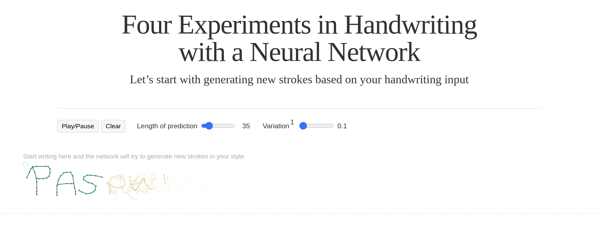
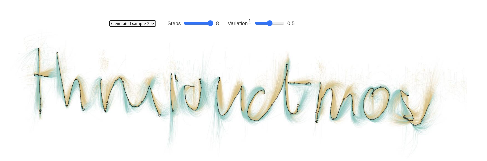

# Carter et al. (2016) | Four Experiments in Handwriting with a Neural Network (Distill publication)

This, like so man other publications on the topic, is by the amazing people of Google Brain. Co-authors are David Ha and Chris Olah.

The publication comes, like so many Distill posts, in the format of a beautiful, interactive website using d3.js.


```{admonition} Available resources at a glance
* Authors: Carter, Shan and Ha, David and Johnson, Ian and Olah, Chris
* [Website (Distill publication)](https://distill.pub/2016/handwriting/)
* DOI: 10.23915/distill.00004
* [Github repository](https://github.com/distillpub/post--handwriting)
```


:::{figure-md} carter_et_al_cover


Screenshot of the [Carter et al. online publication on Distill](https://distill.pub/2016/handwriting/)
:::


## Visual results


:::{figure-md} carter_et_al_sample


Screenshot of the [Carter et al. online publication on Distill](https://distill.pub/2016/handwriting/)
:::


## Model architecture

The DNN architecture used for this Distill publication was an LSTM, that is, a type of Recurrent Neural Network (RNN). RNNs are able to learn sequences of input data. Because the LSTM is able to remember previous strokes, it is "therefore able to remember things like how loopy or jerky the handwriting is, or which letter preceeded the current one".

The model is described as having "500 cells which act as a sort of memory which it will use as part of its input when deciding what to generate".


## Data representation

The handwriting is represented not as SVG but as a sequence of strokes.
Each stroke is encoded as x and y coordinates (absolute or as delta x and delta y) as well as the binary pen state (pen up or pen down?).

The data representation is similar to the slightly more elaborate data representation later used in Google's "Quic, Draw!" dataset and the subsequent paper "A Neural Representation of Sketch Drawings" by Ha and Eck.


