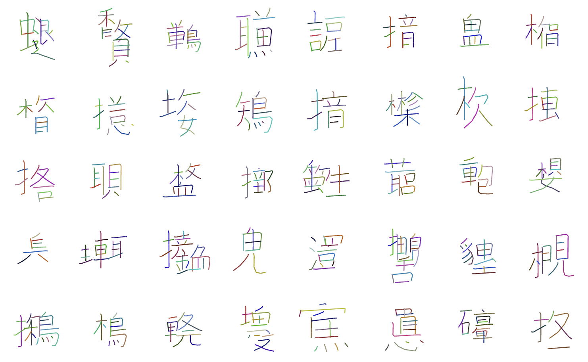

# David Ha (Dec 2015) | Recurrent Net Dreams Up Fake Chinese Characters in Vector Format with TensorFlow (blog post)

In December 2015, David Ha wrote a couple of inspiring blog posts...


```{admonition} Available resources at a glance
* [Website (post on otoro.net, David Ha's blog)](https://blog.otoro.net/2015/12/28/recurrent-net-dreams-up-fake-chinese-characters-in-vector-format-with-tensorflow/)
```


:::{figure-md} ha_2015_kanji_cover


Screenshot of fake Kanji characters generated from a LSTM-Mixture Density Network in SVG Format using sketch-rnn; taken from [David Ha's blog post](https://blog.otoro.net/2015/12/28/recurrent-net-dreams-up-fake-chinese-characters-in-vector-format-with-tensorflow/)
:::
