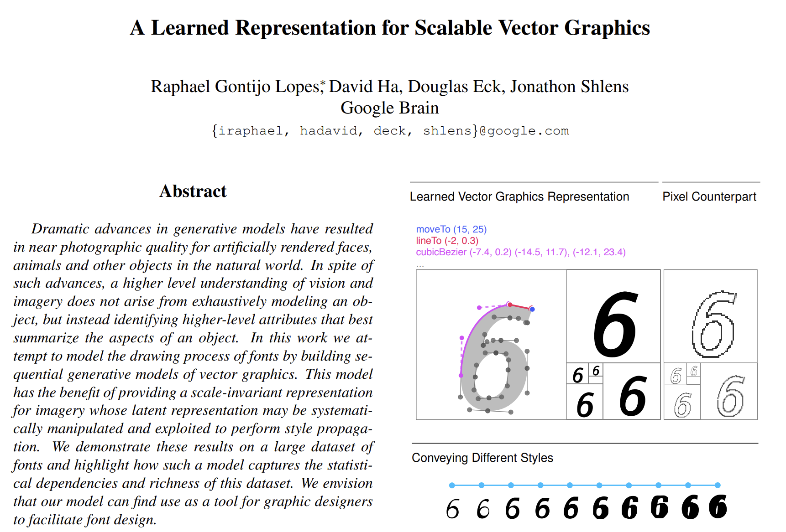
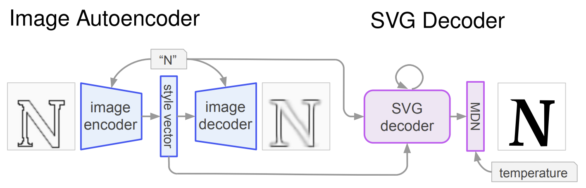
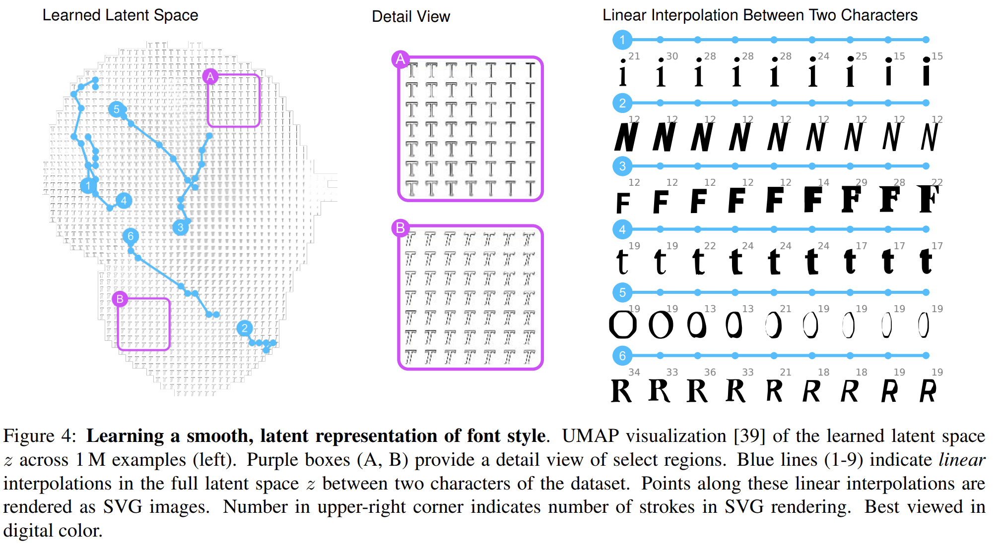
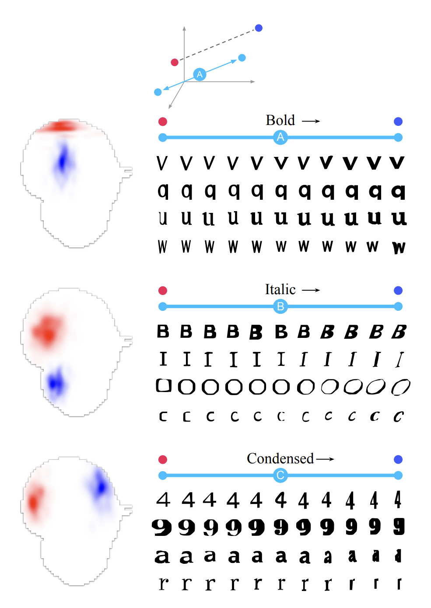
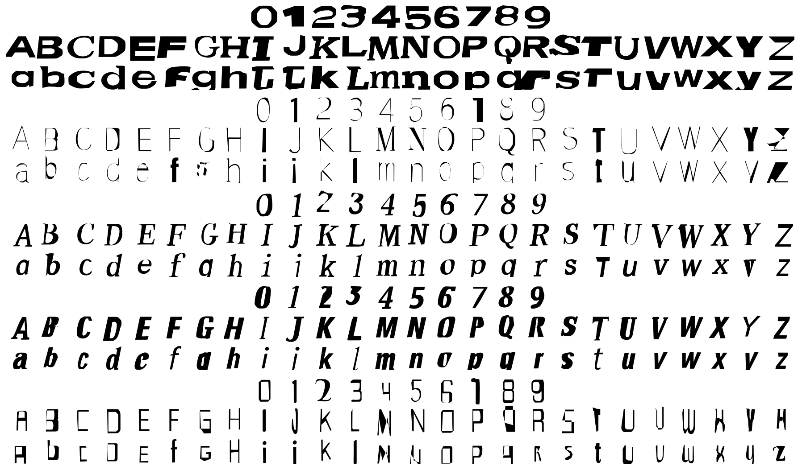

# Lopes et al. (2019) | A Learned Representation for Scalable Vector Graphics (svg-vae)

Lopes et al. propose a generative model for vector graphics called "svg-vae". The work focusses on SVGs obtained from fonts which limits the complexity compared to SVGs found in the wild. Only 4 SVG commands are considered: `moveTo`, `lineTo`, `cubicBezier` and `EOS` (end of sequence).

```{admonition} Available resources at a glance
* [arXiv URL to the paper](https://arxiv.org/abs/1904.02632)
* [Implementation as part of Google's Magenta, Github repo](https://github.com/tensorflow/magenta/tree/master/magenta/models/svg_vae)
* [Jupyter Notebook provided by Lopes](https://github.com/iRapha/magenta-demos/blob/master/colab-notebooks/vae_svg_decoding.ipynb)
* [Model checkpoints as tar.gz](https://storage.googleapis.com/magentadata/models/svg_vae/svg_vae.tar.gz)
* An unofficial [PyTorch implementation of SVG-VAE](https://github.com/hologerry/svg_vae_pytorch) has also been developed
```

:::{figure-md} svg-vae-home-fig


Screenshot of the SVG-VAE [paper](https://arxiv.org/abs/1904.02632)
:::

## Dataset

Lopes et al. collected a total of 14 million font characters in a common format for fonts called SFD.

### SFD format

SFD stands for [Spline Font Database](https://fontforge.org/docs/techref/sfdformat.html) and is an ASCII text format for the [font editing software FontForge](https://fontforge.org/docs/index.html).

### Filtering to 0-9, a-z, A-Z

Out of all the glpyhs contained in the fonts, only characters whose Unicode id corresponded to the classes 0-9, a-z, A-Z were retained.

Filtering by Unicode id was found to be imperfect. Many icons intentionally declare an id such that equivalent characters can be rendered in that font style (e.g.: 七 sometimes declares the unicode id normally reserved for 7).

### Conversion to SVG

Lopes et al. convert the SFD glyphs to SVG. 

## Data representation

Lopes et al. found that SFD fonts can be modelled with a single path and a subset of the possible path data commands. Only the subset of 3 SVG commands (`moveTo`, `lineTo`, `cubicBezierCurve`) and an additional `EOS` command were used. Each SVG character is, thus, modelled as a single sequence of commands.


### Filtering out characters with more than 50 commands

In order to aid learning, characters with over 50 commands are filtered out .

### Relative positioning

Lopes et al. stress that they found it crucial to use **relative** positioning in the arguments of each command.

```{admonition} Open question
:class: important
Note that Lopes et al. stress how important relative positioning was. Carlier et al. (DeepSVG), however, use absolute positioning. In what situations should one prefer which positioning logic?
```

### Rescaling

Arguments of all icons are re-scaled to ensure that most real values in the dataset will lie in similar ranges. This process preserves size differences between icons. 

### Standardize start point and command ordering

Command ordering within a path is standardized such that each shape **begins and ends at its top-most point**.

**Curves always start by going clockwise**. Lopes et al. found that setting this prior was important to remove any ambiguity regarding where the SVG decoder should start drawing from and which direction (information which the image encoder would not be able to provide).

### Converting SVG into a feature vector

Lastly, Lopes et al. convert the SVG path into a vector format suitable for training a neural network model: each character is represented by a sequence of commands, each consisting of tuples with:
* a one-hot encoding of command type (moveTo, lineTo, etc.)
* a normalized representation of the command’s arguments (e.g.: x, y positions).

### Final structure

The final dataset consists of a sequence of commands specified in tuples. Each item in the sequence consists of a discrete selection of an SVG command paired with a set of normalized, floating-point numbers specifying command arguments.


## Model architecture

:::{figure-md} svg-vae-model-fig


Screenshot of the SVG-VAE model architecture; taken from [paper](https://arxiv.org/abs/1904.02632)
:::

"Visual similarity between SVGs is learned by a class-conditioned, convolutional variational autoencoder (VAE) on a rendered representation (blue). The class label and learned representation z are provided as input to a model that decodes SVG commands (purple). The SVG decoder consists of stacked LSTMs followed by a Mixture Density Network (MDN)."


## Latent space interpolation

:::{figure-md} svg-vae-interpolations-fig


Screenshot of linear interpolations; taken from [paper](https://arxiv.org/abs/1904.02632)
:::


The trained model allows for the generation of new characters and fonts by leveraging linear interpolations between two characters or two positions in the latent space.


## Semantically meaningful directions in latent space

:::{figure-md} svg-vae-directions-fig


Screenshot of meaningful directions in latent space; taken from [paper](https://arxiv.org/abs/1904.02632)
:::

Interestingly, semantically meaningful directions could be identified. Examples, as shown above, are:
* Font weight: from light to bold
* Oblique or italic type
* Condensed


## Example results

:::{figure-md} svg-vae-results-fig


Screenshot of a sample of randomly generated fonts; taken from [paper](https://arxiv.org/abs/1904.02632)
:::


## Remarkable aspects of this work


* One of the first papers to develop an encoding scheme for SVG fonts that allows fonts to be fed into a Deep Learning model
* The paper demonstrates that different styles of fonts can be learned by the model


## Discussion and limitations

The paper is not easy to replicate with a relatively complicated pipeline including:
* Apache Parquet database
* FontForge's SFD format
* Tensorflow 1.0
* Tensor2Tensor library

The quality of the resulting SVG images is fairly limited.


