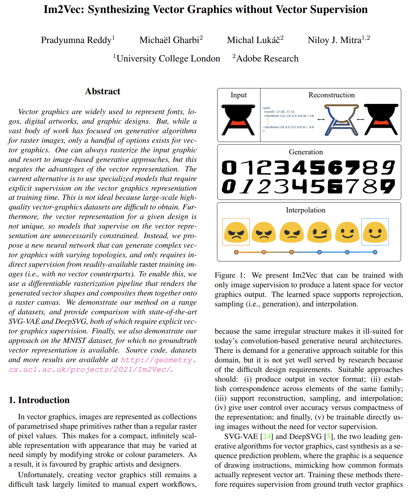
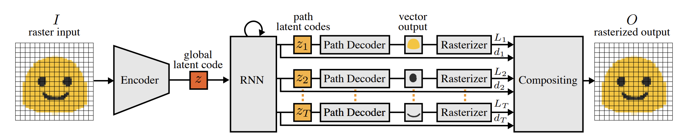
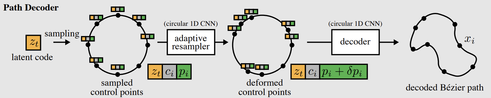

# Reddy et al. (2021) | Im2Vec: Synthesizing Vector Graphics without Vector Supervision

Reddy et al. propose a new neural network architecture, called Im2Vec, that can generate complex vector graphics with varying topologies, and only requires indirect supervision from readily-available raster training images (and no vector graphics). They use a differentiable rasterization pipeline that renders the generated vector shapes and composites them together onto a raster canvas. The differentiable rasterization is based on the work by Li et al. (2020) and their differentiable renderer "diffvg" which forms a building block of Im2Vec.


```{admonition} Available resources at a glance
* [arXiv URL to the paper](https://arxiv.org/abs/2102.02798)
```


:::{figure-md} reddy_2021_cover


Screenshot of the Im2Vec [paper](https://arxiv.org/abs/2102.02798) by Reddy et al. (2021)
:::


## Architecture


:::{figure-md} reddy_2021_architecture


Screenshot of the Im2Vec architecture; taken from the [paper](https://arxiv.org/abs/2102.02798) by Reddy et al. (2021)
:::


Im2Vec overall architecture is an end-to-end variational autoencoder (VAE). The architecture does not rely on vector graphics as inputs. Instead, a raster image is encoded to a latent code $z$ (left part of the figure above).
This latent code $z$ is then decoded to a set of ordered closed vector paths using a Path Decoder. The vector paths are then rasterized using DiffVG and composited together using DiffComp to obtain a rasterized overall output. This rasterized overall output can then be compared to the ground truth raster target for supervision at training time.
The model can handle graphics with multiple component paths. It uses an RNN to produce a latent code $z_t$ for each path, from the global latent code $z$ representing the graphic as a whole.


:::{figure-md} reddy_2021_architecture_decoder


Screenshot of the Im2Vec path decoder; taken from the [paper](https://arxiv.org/abs/2102.02798) by Reddy et al. (2021)
:::


The figure above shows the architecture of the path decoder which takes the latent codes for each path and outputs the corresponding vector graphic. The vector graphic output is limited to closed Bézier paths.