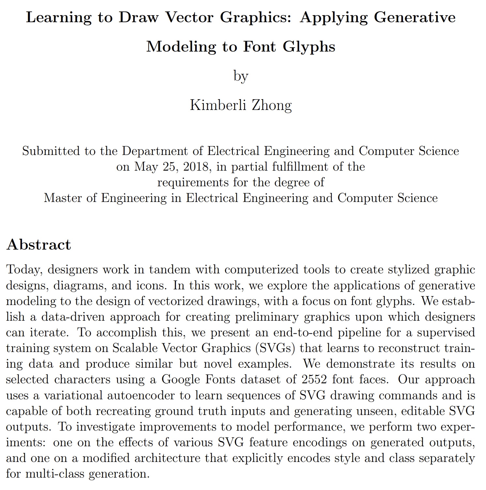
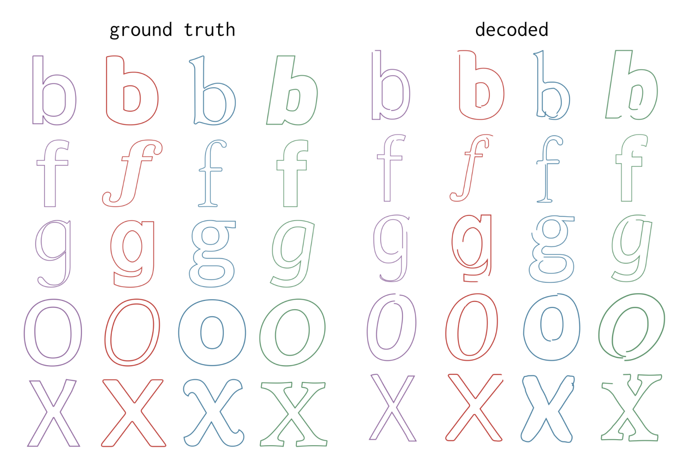

# Kimberli Zhong (2018) | Learning to Draw Vector Graphics: Applying Generative Modeling to Font Glyphs (Master thesis @ MIT)

This thesis uses SVGs as inputs and appears to be the first or one of the first publications using SVGs in an end-to-end pipeline. Part of the contribution of this publication is a first suggestion for a data representation of the SVG input data that is suitable for being fed into a neural network.

The thesis heavily borrows from and references the paper "A neural representation of sketch drawings" by Ha and Eck.


```{admonition} Available resources at a glance
* [URL to the thesis](https://dspace.mit.edu/bitstream/handle/1721.1/119692/1078149677-MIT.pdf?sequence=1)
```


:::{figure-md} zhong_2018_cover


Screenshot from the [thesis](https://dspace.mit.edu/bitstream/handle/1721.1/119692/1078149677-MIT.pdf?sequence=1)
:::


## Results

:::{figure-md} zhong_2018_results


Screenshot from the [thesis](https://dspace.mit.edu/bitstream/handle/1721.1/119692/1078149677-MIT.pdf?sequence=1)
:::

## Dataset

The dataset used are SVGs of characters obtained from Google Fonts.
The font standard TTF (TrueType fonts) is not as expressive as SVG. Thus, the SVG obtained from the TTFs will be simpler than SVGs randomly scraped off the Web. According to Zhong, only line and quandratic Bézier curves are supported by TTFs.

## Data representation

The input SVGs are preprocessed and simplified. The focus is on path generation exclusively.

### Preprocessing

* Stroke and fill information is stripped.
* The dataset is homogenized:
  * Rescaling to same overall canvas size (256 x 256 pixels)
  * Reordering paths in the drawing sequence so that paths with larger bounding boxes are drawn first
* SVG primitives, such as rectangles, circles, etc. were not included in the SVG inputs since the SVGs were obtained from TTF fonts.
* Overly complex glyphs (resulting in more than 250 feature vectors) were ignored and removed from the training dataset

### Simplifying path commands

* Zhong represents *all* path commands as cubic Bézier curves
  * Lines, quadratic Bézier curves and cubic Bézier curves are modelled using cubic Bézier curves
  * Elliptical arc segments cannot be perfectly transformed into a cubic Bézier. They are approximated as cubic Béziers.

### Pen state vector

Similar to the paper by Ha and Eck, a three-dimensional one-hot pen state vector is used.

### New paths

For each move command and each disjoint path, we insert a feature vector that encodes the new end point and sets the pen state to note that the pen is up.

### Feature vector

* Each SVG is transformed into a sequence of commands.
* Permitted commands are:
  * Move
  * Line
  * Quadratic Bézier
  * Cubic Bézier
  * Arc
* Each drawing command is encoded as a *9-dimensional feature vector* (as opposed to the 5-dimensional feature vector used for the polylines in the Ha & Eck paper).
  * 6 dimensions are used to model the 3 (x,y) coordinates required for cubic Bézier curves
  * 3 further dimensions are a one-hot vector used to model the pen state (pen down, pen up, end drawing)
* "Shorter" SVGs are padded using "end drawing" vectors to ensure that all SVGs results in feature vectors of identical length.


```{admonition} Open question
:class: important
Why is pen up and pen down two variables? Is that not a binary state? Or is that poorly phrased and identical to Ha & Eck?
```


## Model architecture

The *overall model* is a bidirectional sequence-to-sequence variational autoencoder (VAE), similar to Ha & Eck. 


The *encoder* consists of two RNNs, one accepting the sequence of feature vectors in one order and the other accepting the sequence in the reverse order. The final hidden states of both RNNs are concatenated to form a combined output. Both RNNs use LSTM cells with layer normalization.

The combined hidden state vector is then transformed into a $\mu$ vector and a $\sigma$ vector of the same length $n_2$ as the hidden state vector. This is done using using a fully connected layer (and an exponentiation operation to produce a non-negative $\sigma$).
The resulting $\mu$ vector and $\sigma$ vectors are combined with a vector $\mathcal{N}$ consisting of $n_2$ normally distributed Gaussian samples from $\mathcal{N}(0,1)$. This then creates a random latent vector $z$ with $z=\mu + \sigma * \mathcal{N}$.

