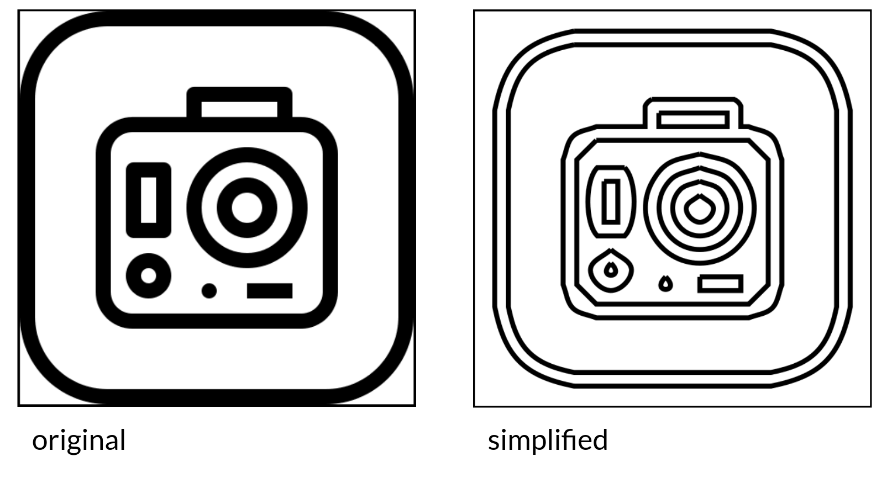
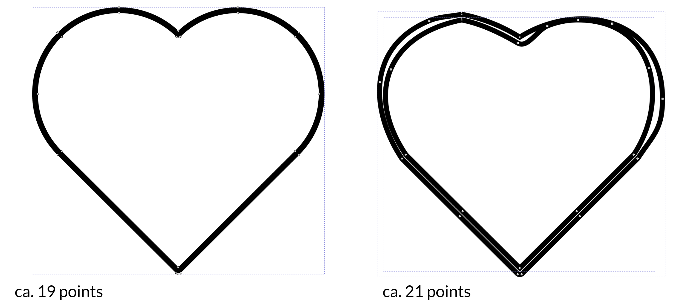
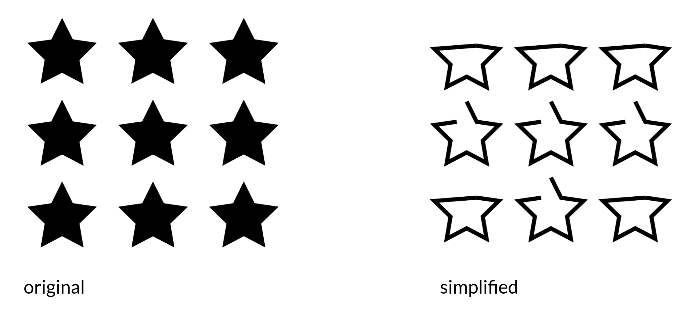

# Only include in book if this turns out to be true

Not sure if this was because of lacking SVG preprocessing with SVGO.
Does this still happen after the SVGO treatment to de-minify SVGs again?

#### Error-prone simplification steps

One source of error appears to be the DeepSVG-internal simplification of SVGs even before they are fed into the learning algorithm. 

##### Unclosed paths

The figure below shows a random input icon and the output of the simplification step. An obvious suspect is the treatment of the `z` (path closing) SVG command since most paths appear to remain unclosed.

:::{figure-md} deepsvg_simplification

Screenshot of the input icon (left) and the resulting icon (right) after having been simplified by the DeepSVG pipeline
:::

##### Simplification increases icon complexity

Another oddity is that the simplification step can actually increase the icon complexity and reduce the overall quality, as shown in the figure below.

:::{figure-md} deepsvg_simplification_increases_complexity

Screenshot of the input icon (left) and the resulting icon (right) after having been "simplified" by the DeepSVG pipeline; the complexity of the icon actually increases and loses its symmetry.
:::

Please note that the input icon was a filled shape. That is why DeepSVG produces two outlines.

##### Repeated identical elements get simplified differently

Surprisingly, repeated identical elements in the same SVG get "simplified" differently.

:::{figure-md} deepsvg_identical_shapes_simplified_differently

Screenshot of the input icon (left) and the resulting icon after having been "simplified" by the DeepSVG pipeline; stars have lost different parts
:::
