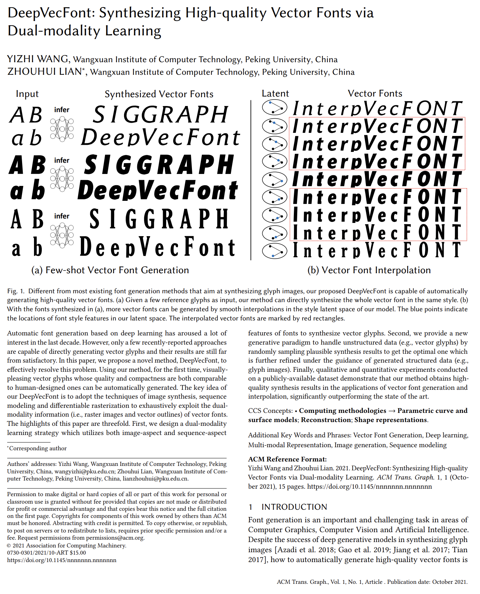

# Wang and Lian (2021) | DeepVecFont: Synthesizing High-quality Vector Fonts via Dual-modality Learning

Wang and Lian specifically address the problem of generating vector glyphs obtained from fonts. The authors build upon the work from Carlier et al. (2020), Ha and Eck (2017), and Lopes et al. (2019). The authors aim to tackle the problem that previous works were not able to synthesize visually pleasing vector glyphs and name two reasons for this issue:
1. Single modality -- they propose to use a dual modality with vector data representation **and** raster image data representation
2. Location shift issue brought by the Mixture Distribution Network -- they propose to employ a differentiable rasterizer (developed in the meantime by Li et al. (2020)) for imposing an additional restriction on the drawing commands predicted by the MDN


This paper was submitted to SIGGRAPH Asia 2021 and published in ACM Transactions on Graphics.


```{admonition} Available resources at a glance
* [arXiv URL to the paper](https://arxiv.org/pdf/2110.06688.pdf)
* [Github repository with code](https://github.com/yizhiwang96/deepvecfont)
* [Project website on github.io with a short video](https://yizhiwang96.github.io/deepvecfont_homepage/)
```


:::{figure-md} wang_and_lian_2021_cover


Screenshot of the DeepVecFont [paper](https://arxiv.org/pdf/2110.06688.pdf) by Wang and Lian (2021)
:::


## Data representation

Like most other papers, Wand and Lian only consider 4 SVG commands.

1. Move -- moving the drawing location (for starting a new path)
2. Line -- drawing a line
3. Curve -- Cubic Bézier Curve
4. End -- ending the draw-command sequence